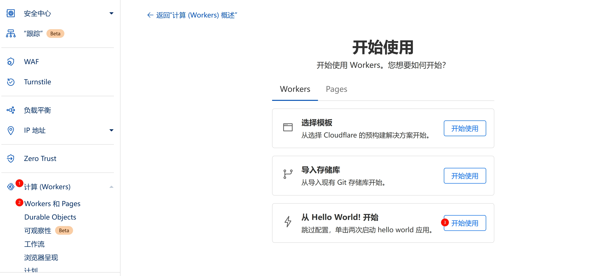
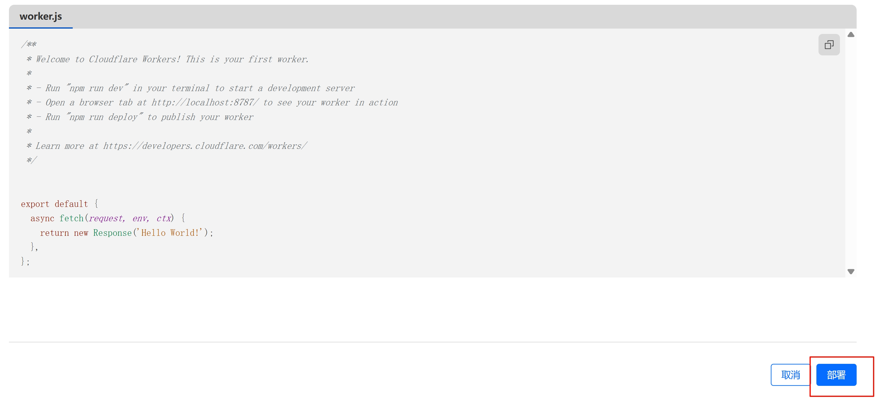
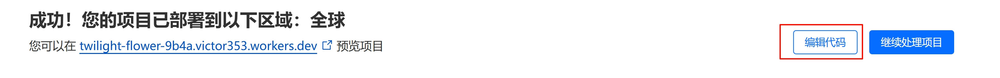
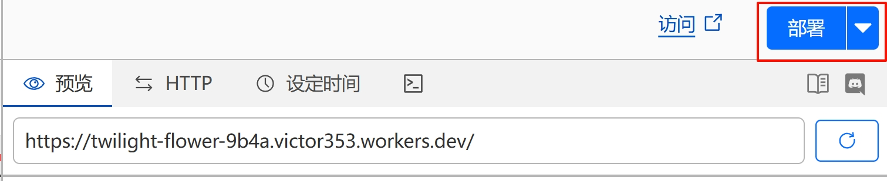
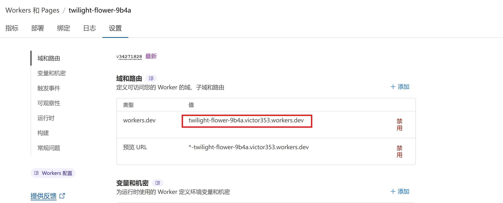
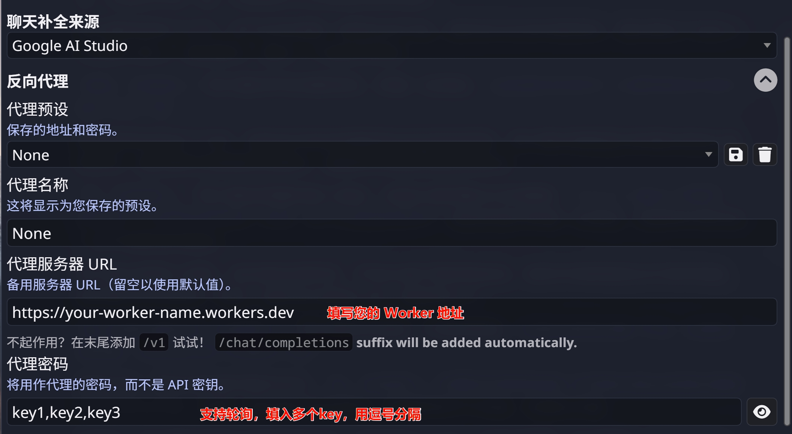

# 使用教程

需要准备的内容
  - 一个Cloudflare账号
---
### 1. 登陆到[Cloudflare](https://dash.cloudflare.com/login)，如果没有请先注册账号

### 2. 在左侧边栏点击`计算(Workers)`，选择`Workers 和 Pages`，选择创建`从 Hello World!开始`，点击`开始使用`
  

### 3. 继续点击`部署`
  

### 4. 页面显示成功后，点击`编辑代码`
  

### 5. 复制worker.js中的代码，然后点击右上角的`部署`
  

🎉 您已经完成部署
---
## 在 SillyTavern 中使用

- 在 Worker 的设置选项中，可以查看您的 Worker 地址，格式为``https://your-worker-name.workers.dev``

- 在 SillyTavern 中，选择 Google AI Studio，在反向代理中填写`代理服务器 URL`为您的 Worker 地址，在代理密码中填写您的 Google API Key

- 支持多个api key轮询，用`,`分隔即可